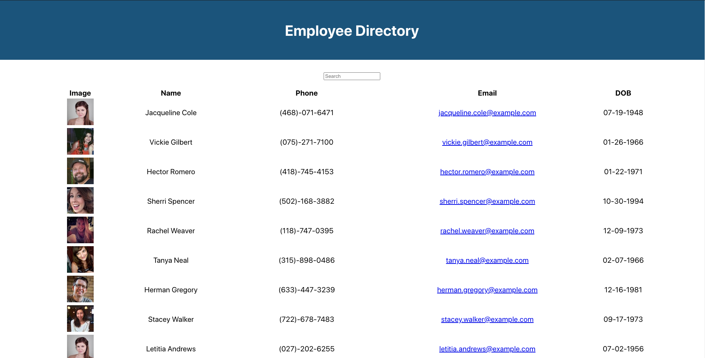

# Emp-Dir

## Table of Contents

- [Description](#description)
- [Installation](#installation)
- [Usage](#usage)
- [License](#license)
- [Contributing](#contributing)
- [Tests](#tests)
- [Questions](#questions)
- [Deployment](#deployment)

## Description

An employee directory displaying employee information. The employee information is sortable by the name column.

## Installation

To install dependencies, run the following command:

```
npm i
```

## Usage

Requirements to use Emp-Dir: an internet connection, a browser.

## License

No license required

## Contributing

To contribute to this project perform a Github fork

## Tests

No tests required

## Questions

If you have any questions you can contact me direct at <jeffhogg86@gmail.com>. Check out my other repositories at [bosshogg86](https://github.com/bosshogg86).

[](https://github.com/bosshogg86)

[](https://twitter.com/JeffHogg86)

## Deployment

[](https://bosshogg86.github.io/emp-dir/ "Emp-Dir")
